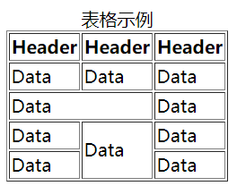
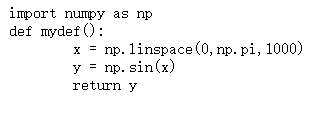

# HTML基础标签

## 目录
  - [HTML文件的基本结构](#html文件的基本结构)
  - [基础标签](#基础标签)
  - [列表标签](#列表标签)
  - [表格标签](#表格标签)
  - [表单标签](#表单标签)
  - [文字标签](#文字标签)

## HTML文件的基本结构

```HTML
<!DOCTYPE html>
<html>
	<head>
		<meta charset="utf-8">
		<title></title>
	</head>
	<body></body>
</html>
```
其中：
 - `<!DOCTYPE html> `申明了使用的规范是HTML5
 - `<html> … </html>`：这两个标签告诉浏览器中间的代码使用html写的；
 - `<head> … </head>` ：网页头部，用户在使用浏览器的时候头部是看不见的，里面包括一些网页的特性、标题；
 - `<meta> … </meta>`：包含网页元数据，比如指定网页的编码；
 - `<body> … </body>`： 这部分代码是可视内容。 

## 基础标签

`p`标签是表示段落的，而`br`标签是表示换行。虽然使用`br`标签可以达到`p`标签的效果，但是实际意义是不同的，最好不要相互代替。

`h1`~`h6`为标题标签，这个对应markdown中 `#` 的功能。

在HTML中，**如果需要空格，必须使用`&nbsp`，** 直接键入空格是无效的。

## 列表标签

|标签|标签含义|备注|
|:-:|:-|:-|
|`ul`|无序标签|利用`style`可设置显示的形状|
|`ol`|有序标签|利用`start`可设置开始数字，`type`可以设置显示数字或者字母|
|`li`|列表条目| |

除此之外，对于词条形式有相关标签：
|标签|标签含义|
|:-:|:-:|
|`dl`|定义列表|
|`dt`|项目词条|
|`dd`|项目词条的定义部分|

## 表格标签

|标签|标签含义|
|:-:|:-:|
|`table`|表格|
|`caption`|表格标题|
|`tr`|表格的一行|
|`th`|表格的header|
|`td`|表格的数据|

这里需要注意的是如果要使表格数据跨多列使用 `colspan`，如果要使表格数据跨多行使用 `rowspan`：
```HTML
<table border="" cellspacing="" cellpadding="">
    <caption>表格示例</caption>
    <tr>
        <th>Header</th>
        <th>Header</th>
        <th>Header</th>
    </tr>
    <tr>
        <td>Data</td>
        <td>Data</td>
        <td>Data</td>
    </tr>
    <tr>
        <td colspan="2">Data</td>
        <td>Data</td>
    </tr>
    <tr>
        <td>Data</td>
        <td rowspan="2">Data</td>
        <td>Data</td>
    </tr>
    <tr>
        <td>Data</td>
        <td>Data</td>
    </tr>
</table>
```
显示效果如图：



## 表单标签

表单标签是用于向后台提供数据的标签，样式比较多，主要有几种：
```html
<form >
    <input type = "***" name = "***" id = "***" value = "***"/>
</form>
```
上面这种形式中`type`可以是单行文本、颜色、日期、邮件等等，具体使用时再查询，要注意的是其中`name`值是后端服务器获取时要使用的 。

要注意如果服务器要使用表单数据时，一定要在`form`中明确`methods`是POST还是GET。

```html
<form >
    <textarea row="***" cols="***"">
文本输入
    </textarea>
</form>
```
这种形式为多行文本输入，而且`textarea`标签中的空格也会被显示。
```html
<form >
    <select>
        <option value ="上海">上海</option>
        <option value ="北京">北京</option>
    </select>
</form>
```
上面形式为下拉菜单选择，修改`multiple`属性可以修改为多选模式。

## 文字标签

|标签|标签含义|
|:-:|:-|
|`b`|字体外观加粗|
|`strong`|重要部分内容，外观加粗|
|`i`|斜体|
|`em`|重要部分内容，外观加粗|
|`ins`|下划线|
|`del`|删除线|
|`small`||
|`big`||
|`mark`|高亮显示|
|`sub`|字体下标|
|`sup`|字体上标|
|`pre`|预格式化文本|
|`blockquote`|文本引用|

其中预格式化文本：
```HTML
<pre>
import numpy as np
def mydef():
	x = np.linspace(0,np.pi,1000)
	y = np.sin(x)
	return y
</pre>
```
