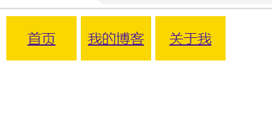

# 样式

## 目录

  - [line-height 属性](#line-height-属性)
  - [background 属性](#background-属性)
  - [内联样式](#内联样式)
  - [属性选择器](#属性选择器)
  - [伪类](#伪类)
  - [组合选择器](#组合选择器)

## line-height 属性

通过设置 text-align 可以使文字水平居中；通过设置 line-height 可以实现文字垂直居中。

实例如下：
```html
<a href="" style="height: 50px; width: 80px;display: inline-block;
background-color: gold; text-align: center; line-height: 50px;">首页</a>
<a href="" style="height: 50px; width: 80px;display: inline-block;
background-color: gold; text-align: center;line-height: 50px;">我的博客</a>
<a href="" style="height: 50px; width: 80px;display: inline-block;
background-color: gold; text-align: center;line-height: 50px;">关于我</a>
```

效果：



## background 属性

为了在图片显示时减少导入次数，有时会将多张小图片汇集到一张大图片上然后控制显示部分达到效果。

实例见下：

```HTML
<p style="background: url(../img/1.png);background-repeat: no-repeat;
line-height: 40px;">
    &nbsp;&nbsp;&nbsp;&nbsp;&nbsp;&nbsp;&nbsp;&nbsp;
        hello world
</p>
<p style="background: url(../img/1.png);background-repeat: no-repeat;
background-position: 0 -48px; line-height: 40px;">
    &nbsp;&nbsp;&nbsp;&nbsp;&nbsp;&nbsp;&nbsp;&nbsp;
        hello world
</p>
```
原图如下：


显示效果为：


## 内联样式

内嵌样式是指的在标签内的 style 里直接设置标签的样式；而内联样式是在html的 `head` 内的 `style` 标签里进行样式设置，这样提高了代码复用的灵活性。

具体的样式选择方法有：
- 对所有元素进行设置时使用 `*`
- 对某一标签进行设置时直接输入标签名
- 对于某一类进行设置时在类名前加 `.`
- 对于某一id进行设置时在id名前加 `#`

```HTML
p{
    color: #FF0000;
}
#title{
    font-size: 20px;
}
.group1{
    color: blue;
}
```

## 属性选择器

属性选择器为 `[]`，从此衍生出的属性选择方法有：
1. [属性名 = '*']：属性值为 `*` 的标签
2. [属性名* = '*' ]：属性值包括 `*` 的标签
2. [属性名^ = '*' ]：属性值以 `*` 开头的标签
2. [属性名$ = '*' ]：属性值以 `*` 结尾的标签
2. [属性名| = '*' ]：属性值以 `*` 开头或者包含 `*` 的标签

```html
[class*="group2"]{
    color: green;
}
[class$="a"]{
    font-size: 30px;
}
[class^="B"]{
    font-weight: bold;
}
[type="email"]{
    background-color: #000000;
}
```

## 伪类

现在知道的伪类基本分为两类：一类是控制链接的相关效果，另一类是找到子元素：
|伪类|功能|
|:-:|:-|
|`a:link`|未访问链接的显示效果|
|`a:visited`|已访问链接的显示效果|
|`a:hover`|鼠标移到链接上的显示效果|
|`a:active`|选定链接的显示效果|
|`:first-child`|第一个子元素|
|`:last-child`|最后一个子元素|
|`:nth-child(n)`|第 n 个子元素|
|`:nth-last-child(n)`|倒数第 n 个元素|
|`:before`|在元素前插入|
|`:after`|在元素后插入|

后两个伪类的例子：

```html
a:before{
    content: "Hello ";
}
a:after{
    content: " end";
}
```

显示效果：


网上看了一下这部分还是比较复杂的，不止自己现在看到这么点东西……

## 组合选择器

- 后代选择器：`.blue li{ }`
- 子代选择器：`.blue>li{ }`
- 兄弟选择器：`#li_1+li{ }`
- **多类选择器**：`.red.bold{ }`，这里是选择同时class内含有这两个的标签，class中空格隔开就可以表示两个类名
- 群组选择器：`.normal,.bold{ }`

