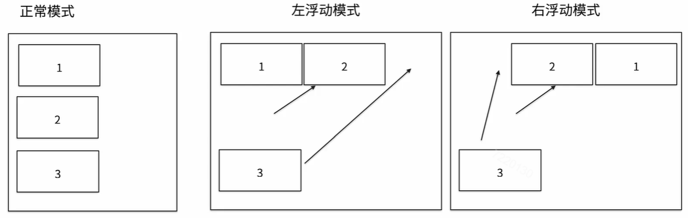
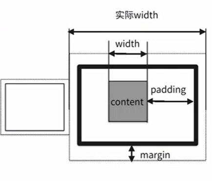

# 布局

## 目录

  - [display属性](#display属性)
  - [float属性](#float属性)
  - [margin 和 padding](#margin-和-padding)
  - [弹性布局](#弹性布局)

## display属性
- none：隐藏元素；
- inline：将块级元素的显示特性变为行级元素的显示特性，会失去宽高属性；
- block：可以将行级元素以块级元素的特性进行显示；
- inline-block：自己拥有宽高又可以有与其他元素同时显示。

## float属性

float 相对于 display 的不同在于 float 是改变了文档中的**排列顺序**，但是 display 只是改变了排列方式，排列顺序不会改变；如果需要恢复标准文件流，则需要使用 clear。



这部分使用的时候其实问题不少……有时候总会出现表达的结果和自己所想要的不一样，后续还需要进一步了解 float 相关知识。

## margin 和 padding

关于 margin 和 padding 属性，用图示表示更为清晰：



需要注意的几个点：
- 多个块元素重叠时，左右排列时块元素距离为二者间和，上下排列时快元素距离为二者距离中的最大值；
- 使用 padding 时会影响块元素的尺寸
- 当使用四个值设置margin 或者 padding时四个值的顺序为：top right bottom left（顺时针顺序）。

## 弹性布局

这部分自己用的不多，掌握的也不是很好，所以参考[阮一峰的网络日志](http://www.ruanyifeng.com/blog/2015/07/flex-grammar.html)进行初步了解。

任何一个容器都可以指定为 Flex 布局。

```HTML
.box{
  display: flex;
}
```
行内元素也可以使用 Flex 布局。

```HTML
.box{
  display: inline-flex;
}
```

Webkit 内核的浏览器，必须加上`-webkit`前缀。

```HTML
.box{
  display: -webkit-flex; /* Safari */
  display: flex;
}
```

具体来说：
- flex-direction属性决定主轴的方向（即项目的排列方向）
    - column：垂直排列
    - column-reverse：垂直翻转排列
    - row：水平排列
    - row-reverse：水平翻转排列
- flex-wrap属性决定了如果一条轴线排不下，如何换行
    - wrap：折行
    - nowrap：不折行，缩小
    - wrap-reverse：折行，第一行在最下面

